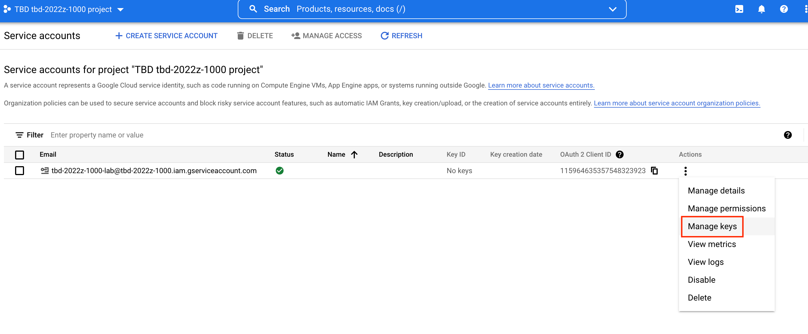
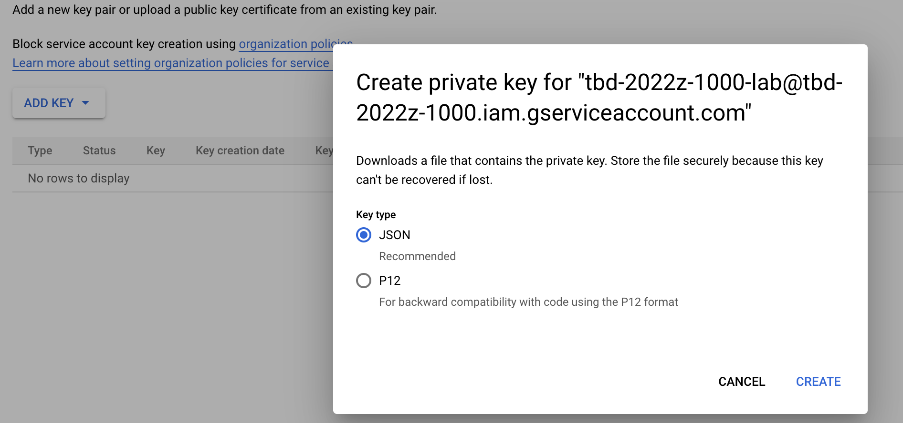
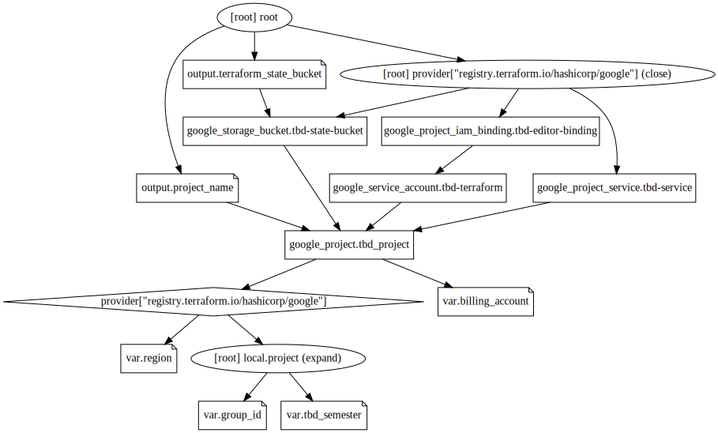
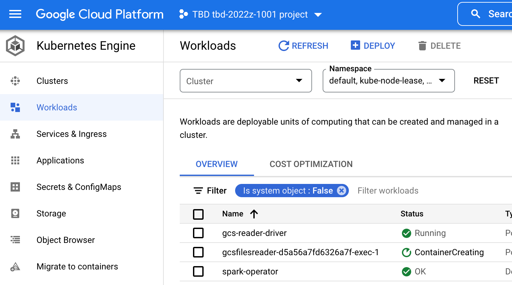
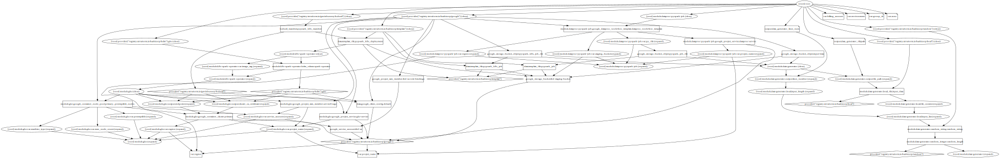

# tbd-2022Z-infra
## Install Terraform and check version
Install terraform and verify version(>=1.1.x)
```bash
terraform --version   
Terraform v1.1.7
on darwin_amd64
```

## Authenticate to GCP cloud
```bash
gcloud auth application-default login
```
## Setup a GCP project and required service account and a bucket for a TF state file
Export **your** [billing account id](https://console.cloud.google.com/billing) as `TF_VAR_billing_account`  and **your** group id as env variables and run Terraform commands.

```bash
cd gcp_project
export TF_VAR_billing_account=011F5D-E7C40A-241242
export TF_VAR_group_id=1001
export TF_VAR_tbd_semester=tbd-2022z
terraform init
terraform apply -var-file ../env/dev/project.tfvars -compact-warnings
```
```bash
Terraform used the selected providers to generate the following execution plan. Resource actions are indicated with the following symbols:
  + create

Terraform will perform the following actions:


Apply complete! Resources: X added, 0 changed, 0 destroyed.

Outputs:

project_name = "tbd-2022z-1001"
terraform_state_bucket = "tbd-2022z-1001-state"

```
1. Use output variable `terraform_state_bucket` and assign it to `bucket` variable in `env/dev/backend.tfvars` file.
2. Open a web browser and navigate to [GCP Console](https://console.cloud.google.com/) (make sure you use the same account as you previously used for `gcloud auth application-default login` command).
3. Select your project from drop-down menu (take a look at `project_name` output variable)

4. Navigate to `IAM & Admin` and `Service Accounts` and then `Manage keys`

5. Add a new key and save it as `sa-terraform-key.json`

Please also read the following article [Choose the best way to use and authenticate service accounts on Google Cloud](https://cloud.google.com/blog/products/identity-security/how-to-authenticate-service-accounts-to-help-keep-applications-secure?_ga=2.54300136.-1524357872.1594788430)
In particular this paragraph:
> Limiting the use of service accounts and service account keys to situations in which they're absolutely necessary keeps user data more secure, reduces the chance of unauthorized activity, and makes it easier to use audit logs to determine which users performed certain operations.

In our case we will store this Key securely as a Github Secret and used for CI/CD process
for infrastructure provisioning.

6. Verify that your Service Account key is working locally:
```bash
gcloud auth application-default revoke --quiet
terraform apply -var-file ../env/dev/project.tfvars -compact-warnings
```
and you *should* get an error message like this:
```bash
│ Error: Attempted to load application default credentials since neither `credentials` nor `access_token` was set in the provider block.  No credentials loaded. To use your gcloud credentials, run 'gcloud auth application-default login'.  Original error: google: could not find default credentials. See https://developers.google.com/accounts/docs/application-default-credentials for more information.
│ 
│   with provider["registry.terraform.io/hashicorp/google"],
│   on provider.tf line 1, in provider "google":
│    1: provider "google" {

```
7. Rerun the following commands:
```bash
export GOOGLE_APPLICATION_CREDENTIALS=/Users/mwiewior/research/tbd/2022z/sa-terraform-key.json
terraform apply -var-file ../env/dev/project.tfvars -compact-warnings
```
and you *should* get the following message:
```bash
No changes. Your infrastructure matches the configuration.

Terraform has compared your real infrastructure against your configuration and found no differences, so no changes are needed.

Warnings:

- Value for undeclared variable
- Value for undeclared variable

To see the full warning notes, run Terraform without -compact-warnings.

Apply complete! Resources: 0 added, 0 changed, 0 destroyed.

Outputs:

project_name = "tbd-2022z-1001"
terraform_state_bucket = "tbd-2022z-1001-state"

```
GCP project bootstrap is done.
Please analyze what entities have been created.

## Create project infrastructure
1. Make sure you are in the **root** of repo (*not* in `gcp_project` directory)
2. Put `project_name` output variable in `env/dev/project.tfvars`
3. Init GCP provider
```bash
export TF_VAR_billing_account=011F5D-E7C40A-241242
export TF_VAR_group_id=1001
export TF_VAR_tbd_semester=tbd-2022z
terraform init -backend-config=env/dev/backend.tfvars -reconfigure
```
4. Apply
```bash
 terraform apply -var-file env/dev/project.tfvars -compact-warnings
```
5. Take a note of the value of the following output variables:
* `data_generator_lines_num`
* `data_generator_filepath`

6. Set current project using gcloud: `gcloud config set project tbd-2022z-1001`
7. Activate SA credentials:
`gcloud auth activate-service-account --key-file=/home/tgambin/Downloads/tbd-2022z-10001-41b4f05aa9e0.json`
9. Run a Dataproc job:
```bash
gcloud dataproc workflow-templates instantiate ${TF_VAR_tbd_semester}-${TF_VAR_group_id}-workflow --region europe-central2
```

8. Verify a Dataproc job output (compare to `data_generator_lines_num`):
```bash
gsutil cat "gs://tbd-2022z-1001-staging/data/output-dataproc.csv/*"
```
```bash
count(1)
88
```

9. Verify a K8s job output(compare to `data_generator_lines_num`): 

```bash
gsutil cat "gs://tbd-2022z-1001-staging/data/output-k8s.csv/*" 
```
```bash
count(1)
88
```
Terraform project graph:

