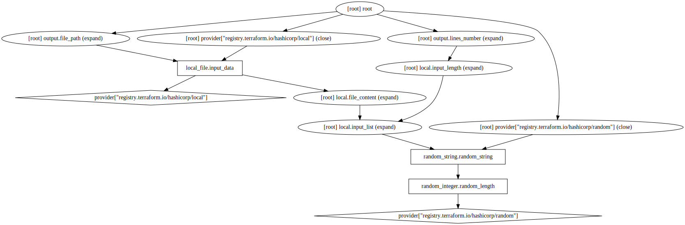
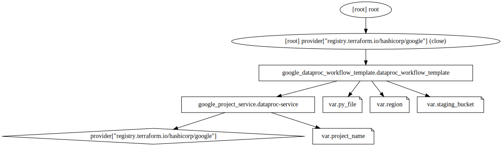
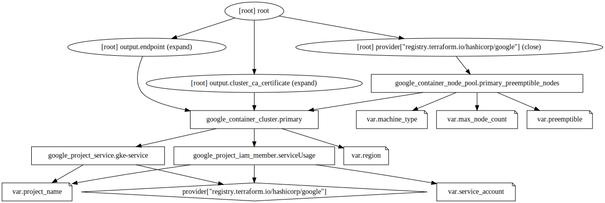
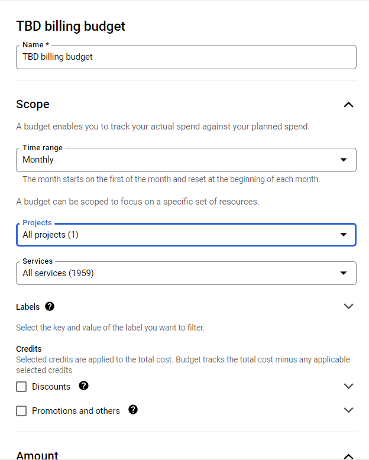
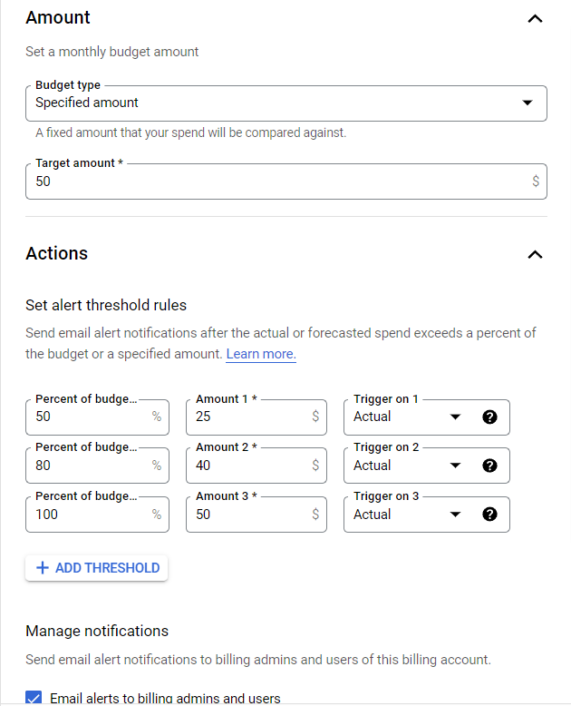
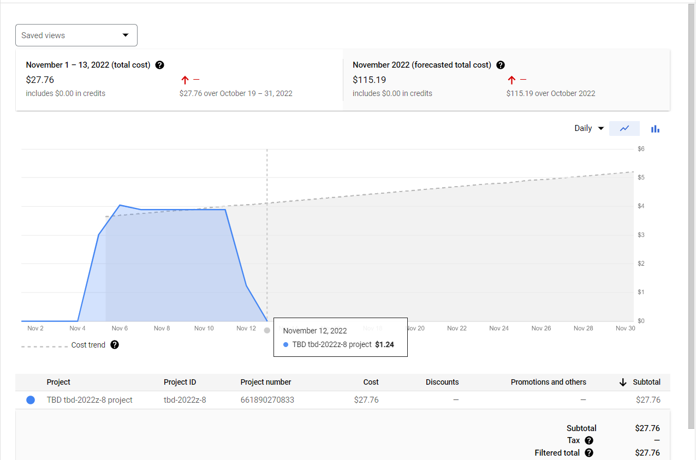
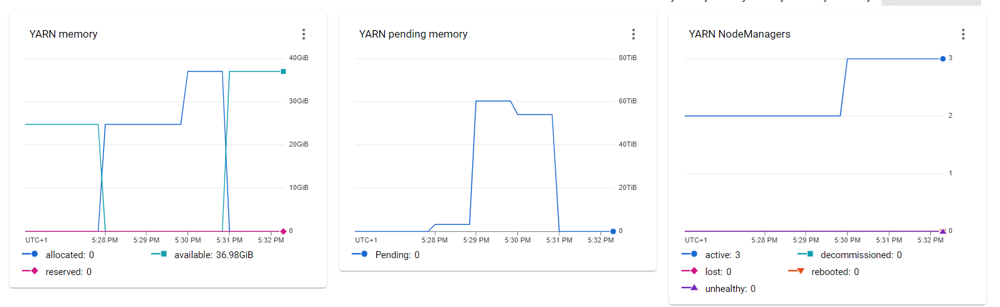
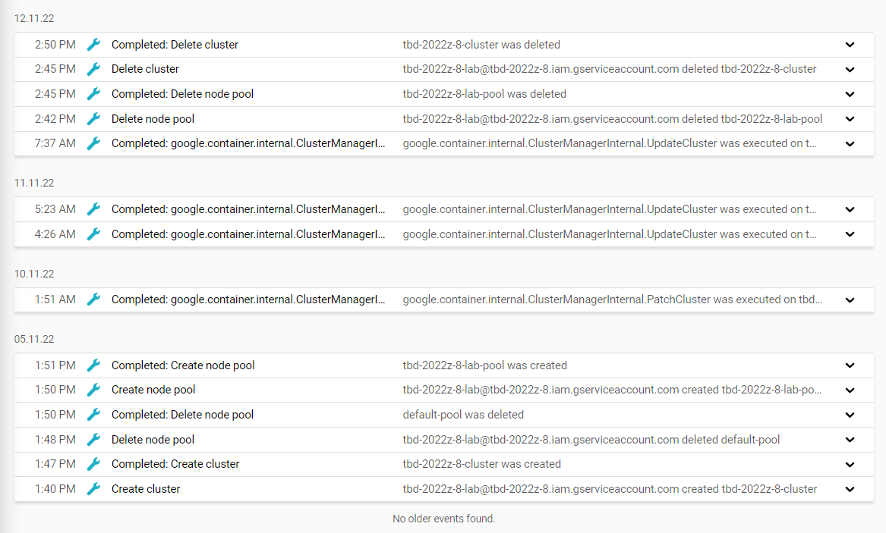
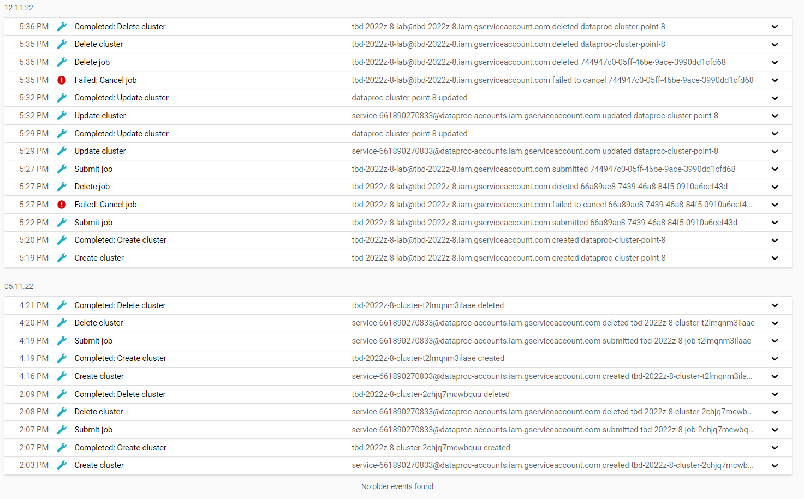

# Etap 1a - sprawozdanie
6.
*Jakie sposoby odwoływania się do modułów Terraform są wykorzystane w
projekcie?*

Trzy odwołania do modułów lokalnych (umieszczonych w innych folderach) oraz jedno odwołanie do modułu zewnętrznego (umieszczonego na innym repozytorium git)

6.a
- data-generator
- dataproc-pyspark-job
- gke
- k8s-spark-operator <- zewnętrzny

6.b:
- `data-generator`

- `dataproc-pyspark-job`

- `gke`

6.c 
- data-generator - losuje string o losowej długości w przedziale [100, 5000], i zapisuje go jako `data/input.csv`.
- dataproc-pyspark-job - pozwala naszemu projektowi na korzystanie z dwóch serwisów API("dataproc.googleapis.com", "workflowexecutions.googleapis.com") oraz tworzy `dataproc_workflow_template`, czyli konfigurację szablonu do wykonywania jobów(np. PySparka) w postaci DAG.
- gke - pozwala naszemu projektowi na korzystanie z serwisu API("container.googleapis.com"), dodaje nową role do naszego account service("serviceusage.serviceUsageAdmin") oraz tworzy klaster wraz z węzłami, z których będzie się składał.
- k8s-spark-operator - tworzy `helm_release`, czyli: klaster `Kuberenetes`a, który wykonuje na sobie paczkę `Helm` o nazwie `Chart`. W naszym przypadku wykorzystywany do wykonywania Sparka.

7.a Budżet z poziomu konsoli.

7.b Wykorzystanie budżetu po kilku dniach.

8. Screen z konsoli GCP. 

**** Potwierdzenie odpalenie jobów
W celu potwierdzenia odpalenia jobów zadanych w poleceniu załączamy zrzuty z logów GCP:
- `GKE`

- `dataproc` - tutaj `Failed:Cancel job` wynika z `Cannot cancel jobId '66a89ae8-7439-46a8-84f5-0910a6cef43d' in projectId 'tbd-2022z-8' in state: 'DONE'; cancellable states: '[PENDING, RUNNING]'` - czyli wszystko przebiegło poprawnie

